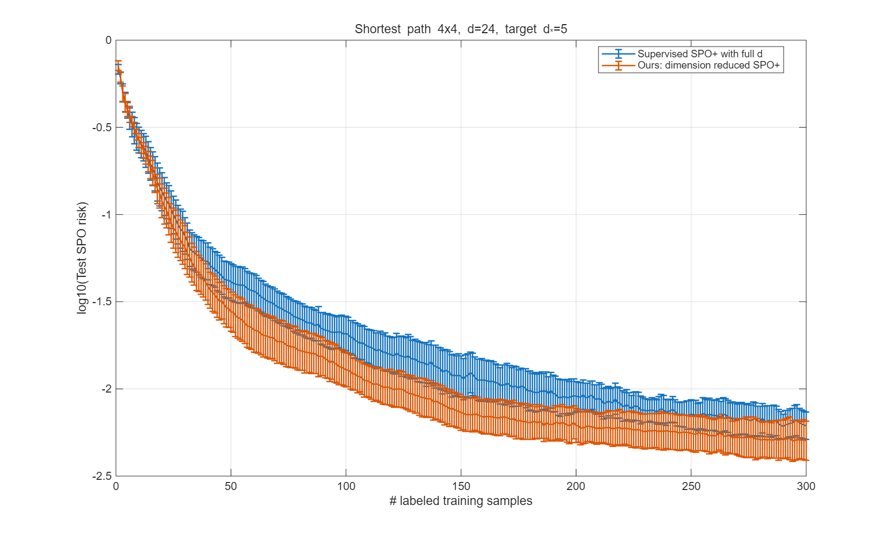
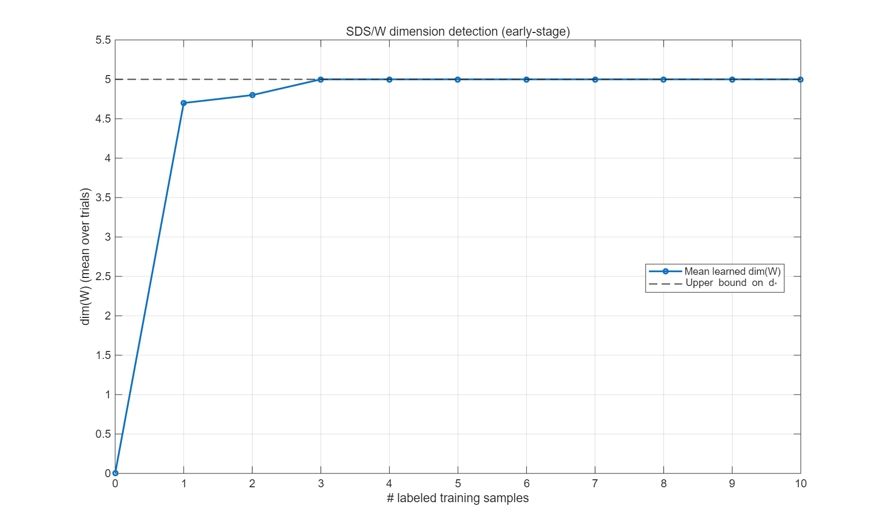
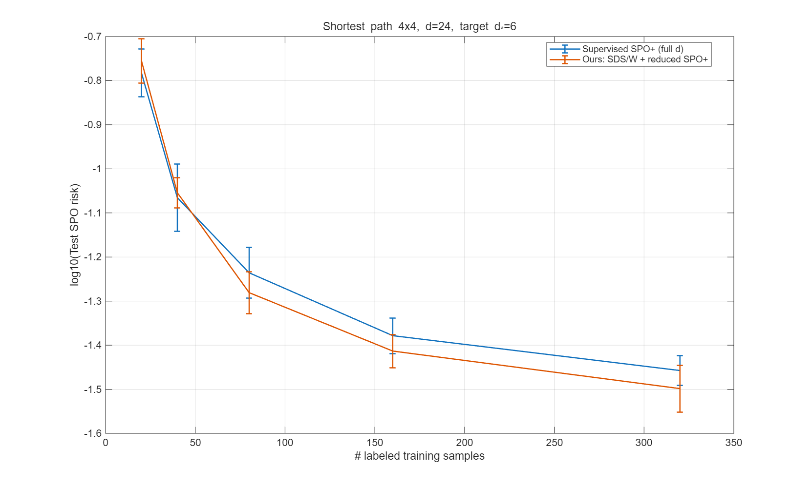
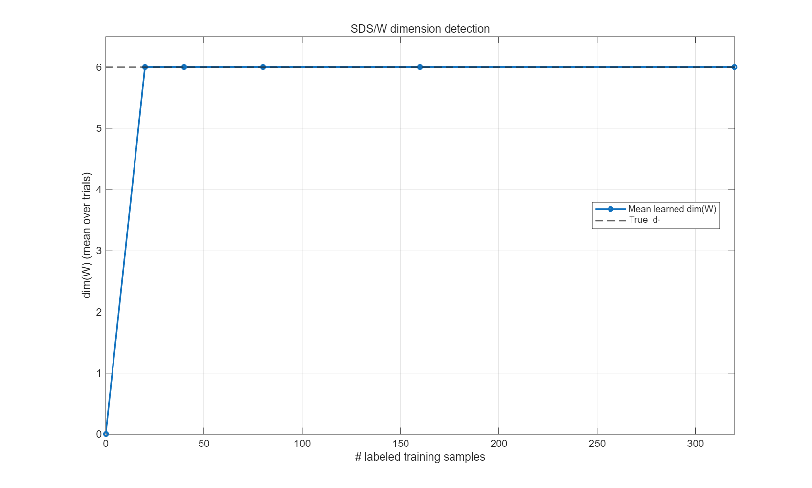

# Learning Decision-Sufficient Representations for Linear Optimization

This repository contains MATLAB code for the numerical shortest-path experiments in the paper **Learning Decision-Sufficient Representations for Linear Optimization**.

The code illustrates the following idea: if optimal decisions depend only on a low-dimensional decision-relevant subspace, then a contextual predictor can be trained in that learned reduced space instead of in the full ambient cost space. Therefore, we can obtain a smaller training model and a sharper generalization bound, with the relevant dimension improving from $d$ to $d^\star$.

---

## Project Overview

This repository contains two shortest-path experiments.

### Experiment 1: Low-affine-dimension setting
**File:** `codes/Version_1_C_with_low_aff_dimension.m`

This is a warm-up experiment. Only a small subset of edge-cost coordinates is allowed to vary, while all remaining coordinates are fixed. Hence, the prior cost set itself is already low-dimensional:

```math
affdim(\mathcal{C}) = d^\star.
```

### Experiment 2: Full-dimensional structured setting
**File:** `codes/Version_2_structured_full_dimension_C.m`

This is the main compression experiment. Every edge cost is allowed to vary inside an interval, so the prior cost set is full-dimensional:

```math
affdim(\mathcal{C}) = d.
```

However, the corridor construction forces every optimal path to lie in a narrow family of paths, so the decision-relevant dimension is still only $d^\star \ll d$.

---

## Toy Model Setting

### Common shortest-path model

Both experiments use a monotone shortest-path problem on a grid.

- Each feasible decision is an $s$-$t$ monotone path.
- Each path is represented by its edge-incidence vector.
- The cost vector $c \in \mathbb{R}^d$ assigns one cost to each edge.
- A context vector $\xi \in \mathbb{R}^p$ is observed, and the goal is to predict a cost vector that induces a good path decision.

### Experiment 1: low-affine-dimension cost set

This experiment uses a $4 \times 4$ grid and context dimension $p=5$.

The code selects a small set $I$ of varying edges, and all remaining edge costs are fixed at the same baseline value $c_0$. The data are generated as

```math
c_e = c_0
\qquad \text{for } e \notin I,
```

and

```math
c_e
=
c_0
+
\Delta \tanh\!\left(\frac{a_e^\top \xi}{\sqrt{p}}\right)
+
\eta_e
\qquad \text{for } e \in I,
```

where $\Delta$ is the signal amplitude and $\eta_e$ is a small noise term.

So in this experiment, only $d^\star = |I|$ coordinates truly vary, and the prior cost set itself has affine dimension $d^\star$.

### Experiment 2: full-dimensional corridor construction

This experiment uses a $4 \times 4$ grid and context dimension $p=5$.

The code first constructs a narrow **corridor** inside the grid. It starts from a base monotone path and enlarges it by adding boundaries of selected unit squares until the corridor-path family achieves the target decision-relevant dimension $d^\star$.

The cost box is then designed so that corridor edges are cheap and outside edges are expensive:

```math
c_e \in [9,11]
\qquad \text{for corridor edges},
```

```math
c_e \in [99,101]
\qquad \text{for outside edges}.
```

Because every coordinate still varies inside an interval, the prior cost set is full-dimensional. At the same time, a domination check ensures that for every $c \in \mathcal{C}$, the optimal path must stay inside the corridor.

The contextual signal is injected only along the true decision-relevant subspace:

```math
c
=
c_{\mathrm{base}}
+
U^\star g(\xi)
+
\varepsilon,
\qquad
g(\xi)
=
\tanh\!\left(\frac{A\xi}{\sqrt{p}}\right).
```

Therefore, although $affdim(\mathcal{C}) = d$, the part of the cost vector that matters for optimal decisions is only $d^\star$-dimensional.

### Compared training models

Both scripts compare two predictors.

The full model is trained directly in the ambient space, so its linear parameter size is

```math
d(p+1).
```

The reduced model first learns a subspace $W$, then trains only on reduced coordinates, so its linear parameter size is

```math
\dim(W)(p+1) \approx d^\star(p+1).
```

This is exactly the sense in which learning a decision-sufficient representation gives a smaller training model and a better dimension-dependent generalization guarantee.

---

## Repository Structure

```text
Learning-Decision-Sufficient-Representations-for-Linear-Optimization/
├── codes/
│   ├── Version_1_C_with_low_aff_dimension.m
│   ├── Version_2_structured_full_dimension_C.m
│   └── results/   % generated automatically after running the code
├── Learning_Decision_Sufficient_Representations_for_Linear_Optimization_arxiv.pdf
└── README.md
```

---

## Requirements

- MATLAB
- Optimization Toolbox (`linprog`)

No external dataset is required.

---

## How to Run

Open MATLAB in the repository folder, open one of the following files in the editor, and click **Run**:

- `codes/Version_1_C_with_low_aff_dimension.m`
- `codes/Version_2_structured_full_dimension_C.m`

Each file is self-contained and automatically saves figures together with a summary `.mat` file under `codes/results/`.

---

## Numerical Experiment

### Experiment 1
The first script runs an online labeled-data experiment with

```math
N_{\mathrm{train}} = 300,
\qquad
N_{\mathrm{test}} = 2000,
\qquad
10 \text{ trials}.
```

It reports:

1. test SPO risk versus number of labeled samples;
2. learned dimension $\dim(W)$ versus number of labeled samples.

### Experiment 2
The second script runs a batch experiment with training sizes

```math
20,\ 40,\ 80,\ 160,\ 320,
```

using

```math
N_{\mathrm{test}} = 2000,
\qquad
10 \text{ trials}.
```

It reports:

1. test SPO risk versus number of labeled samples;
2. learned dimension $\dim(W)$ versus number of labeled samples.

The generated result files are:

- `codes/results/low_affdim_spo_risk.png`
- `codes/results/low_affdim_dimW.png`
- `codes/results/low_affdim_summary.mat`
- `codes/results/full_dim_corridor_spo_risk.png`
- `codes/results/full_dim_corridor_dimW.png`
- `codes/results/full_dim_corridor_summary.mat`

---

## Sample Result

The image paths below assume that the generated PNG files under `codes/results/` are committed to the repository.

### Experiment 1: Low-affine-dimension setting

<p align="center">
  
  
</p>

<p align="center">
  <em>Left: test SPO risk. Right: learned dimension of the discovered decision-sufficient subspace.</em>
</p>

### Experiment 2: Full-dimensional structured setting

<p align="center">
  
  
</p>

<p align="center">
  <em>Left: test SPO risk. Right: learned dimension of the discovered decision-sufficient subspace.</em>
</p>

---

## Author

Yuhan Ye


